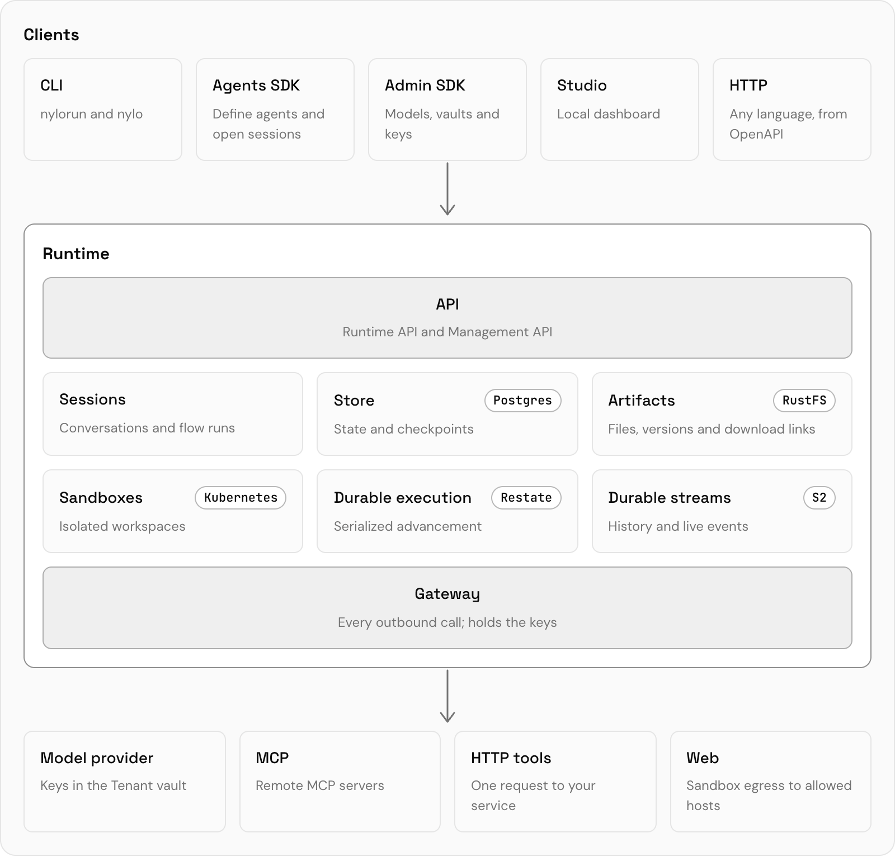

<div align="center">

# Nylorun

**Build AI agents. Run them on a durable, self-hosted Runtime.**

[](https://www.npmjs.com/package/@nylorun/agents)
[](https://github.com/nylorun/agents/actions/workflows/ci.yml)
[](./LICENSE)

[Docs](https://docs.nylorun.com/docs) ·
[Quickstart](#quickstart) ·
[API reference](https://docs.nylorun.com/reference/runtime) ·
[Examples](./examples) ·
[Releases](https://github.com/nylorun/agents/releases)

</div>

> [!WARNING]
> **Beta.** APIs, protocols and on-disk formats change before 1.0. Upgrade every
> Nylorun package together, and read
> [Compatibility](https://docs.nylorun.com/docs/compatibility) before you skip a
> release.

Nylorun is an open-source runtime for AI agents.

- **Agents are declarative.** Define them with the
  [Agents SDK](https://docs.nylorun.com/docs/build) from instructions,
  [tools](https://docs.nylorun.com/docs/build/tools) and
  [MCP servers](https://docs.nylorun.com/docs/build/mcp), and compose in one
  line: `.pipe(researcher, analyst)`. Publish your agent and start a session
  with the Runtime.
- **The Runtime is a Docker Compose stack**: `runtime`, `gateway`, `harness`,
  `studio`, `postgres`, `restate`, `s2-lite` and `rustfs`. Start it with
  `npx nylorun up`; use it from Studio, the CLI, the SDKs or HTTP.

## How it works

<p align="center">
  <picture>
    <source media="(prefers-color-scheme: dark)" srcset="./.github/assets/how-it-works-dark.png">
    
  </picture>
</p>

One installation is one **Tenant**, with its own database, Studio and data.
See [Concepts](https://docs.nylorun.com/docs/concepts) for the vocabulary.

## Quickstart

```sh
npx nylorun up
```

This starts a Runtime and Studio on your machine and prints their URLs. Check
it with `npx nylorun status`; stop it with `npx nylorun down` (volumes stay).

Requires Node.js 24, Docker Compose v2, and a model key if you call a provider.
On Windows, use WSL2 and keep the project on the Linux filesystem.

Next:

- [**Studio**](https://docs.nylorun.com/docs/run/studio): chat with agents and inspect sessions.
- [**Agents SDK**](https://docs.nylorun.com/docs/build): define an agent and give it tools.

## Documentation

The guides live at **[docs.nylorun.com](https://docs.nylorun.com/docs)**.

| Section | Start with |
| --- | --- |
| **Get started** | [Quickstart](https://docs.nylorun.com/docs) · [Concepts](https://docs.nylorun.com/docs/concepts) · [Your project](https://docs.nylorun.com/docs/project) |
| **Build** | [Agent](https://docs.nylorun.com/docs/build/agent) · [Tools](https://docs.nylorun.com/docs/build/tools) · [MCP](https://docs.nylorun.com/docs/build/mcp) · [Flow agents](https://docs.nylorun.com/docs/build/flows) · [Serve your users](https://docs.nylorun.com/docs/build#serve-your-users) |
| **Run** | [Sessions](https://docs.nylorun.com/docs/run/sessions) · [Models](https://docs.nylorun.com/docs/run/models) · [Sandboxes](https://docs.nylorun.com/docs/run/sandboxes) · [CLI](https://docs.nylorun.com/docs/run/cli) |
| **Deploy** | [Docker Compose](https://docs.nylorun.com/docs/deploy/vm) · [Kubernetes](https://docs.nylorun.com/docs/deploy/kubernetes) · [Nylorun Cloud](https://docs.nylorun.com/docs/deploy/cloud) |
| **Reference** | [Runtime API](https://docs.nylorun.com/reference/runtime) · [Management API](https://docs.nylorun.com/reference/management) · OpenAPI: [runtime](https://docs.nylorun.com/openapi/runtime.json), [management](https://docs.nylorun.com/openapi/management.json) |
| **More** | [Compatibility](https://docs.nylorun.com/docs/compatibility) · [Troubleshooting](https://docs.nylorun.com/docs/troubleshooting) · [Use with AI agents](https://docs.nylorun.com/docs/ai-agents) |

Using a coding agent? Point it at [`llms.txt`](https://docs.nylorun.com/llms.txt);
every page is also available as Markdown by appending `.md` to its URL.

## Packages

| Package | Folder | Role |
| --- | --- | --- |
| [`@nylorun/agents`](https://www.npmjs.com/package/@nylorun/agents) | [`agents`](./agents) | Agents SDK: define agents, save them, open sessions; AG-UI and A2A handlers |
| [`@nylorun/admin`](https://www.npmjs.com/package/@nylorun/admin) | [`admin`](./admin) | Admin SDK for the Management API: models, vaults, signing keys, application keys |
| [`nylorun`](https://www.npmjs.com/package/nylorun) | [`nylorun`](./nylorun) | Runs the local Runtime (`up`, `down`, `status`, `logs`, `studio`, `key`); `nylo`, the Runtime client |
| [`@nylorun/cli`](https://www.npmjs.com/package/@nylorun/cli) | [`cli`](./cli) | Deprecated: runs nylorun's `nylo` for one more release |
| [`@nylorun/create-agent`](https://www.npmjs.com/package/@nylorun/create-agent) | [`create-agent`](./create-agent) | `npm create @nylorun/agent`: project scaffolding and compatibility pins |
| [`@nylorun/runtime`](https://www.npmjs.com/package/@nylorun/runtime) | [`runtime`](./runtime) | The Runtime; also the `ghcr.io/nylorun/runtime` image |
| [`@nylorun/harness`](https://www.npmjs.com/package/@nylorun/harness) | [`harness`](./harness) | Execution engine and checkpoints |
| [`@nylorun/core`](https://www.npmjs.com/package/@nylorun/core) | [`core`](./core) | Shared definitions, contracts and manifest identity |
| `ghcr.io/nylorun/studio` (image only) | [`studio`](./studio) | The dashboard |
| `ghcr.io/nylorun/sandboxes` (image only) | [`sandboxes`](./sandboxes) | Go service that runs pod sandboxes on Kubernetes |
| Not published | [`examples`](./examples) | Capability demos on the generated project shell |

## Self-hosting

Everything here runs without a Nylorun account. The Runtime verifies and
enforces; it never signs people in. Your identity provider and secret store
plug in.

- [DEPLOYMENT.md](./guides/DEPLOYMENT.md): the Tenant's containers, reverse proxy and Postgres
- [SELF_HOSTING.md](./guides/SELF_HOSTING.md): your own identity provider and secrets
- [MIGRATION.md](./guides/MIGRATION.md): breaking changes between beta protocols

## Contributing

Requires Node 24 and npm 11.

```sh
git clone https://github.com/nylorun/agents.git
cd agents
npm run setup   # install both lockfiles and build the packages
npm run dev     # build the Runtime and Studio images, run the examples' Tenant
```

`npm run dev` rebuilds packages and images as you edit. The Tenant keeps running
after you stop it, so sessions survive a source change; `npx nylorun down`
stops it. Read [CONTRIBUTING.md](./CONTRIBUTING.md) for checks and workflow and
[RELEASING.md](./guides/RELEASING.md) for publishing. The domain vocabulary is in
[runtime/src/CONTEXT.md](./runtime/src/CONTEXT.md).

## Community

- [GitHub issues](https://github.com/nylorun/agents/issues) for bugs and requests
- [SECURITY.md](./.github/SECURITY.md) to report a vulnerability privately
- [CODE_OF_CONDUCT.md](./.github/CODE_OF_CONDUCT.md)

## License

[Apache-2.0](./LICENSE)
