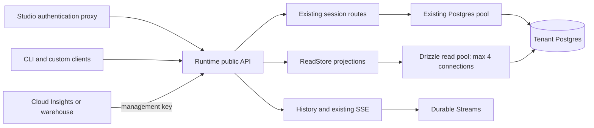

# Session reads API and Studio handoff

R0–R4 of [Session Reads API](https://claude.ai/artifact/PJWYw6wB62AYhAAALPzeAa). Studio, CLI, custom clients and warehouse consumers use the same public Runtime API and authorization. Studio's server proxies authentication; it never connects to Postgres.



| Read | Request | Access |
| --- | --- | --- |
| Pinned session manifest | `GET /v1/sessions/{id}/manifest` | Application; application acting for an owner with `agents:read` or `agents:write` |
| Recorded session usage | `GET /v1/sessions/{id}/usage?turnId=…` | An application key, as itself; no subject scope reaches it |
| Session model calls | `GET /v1/sessions/{id}/calls/model?limit=50&cursor=…&turnId=…` | Same as usage |
| Unfiltered ledger export | `GET /v1/tenant/calls/model?limit=200&after=…` | Management API: a management key, as itself (an application key is `403 key_role_mismatch`) |
| Session page | `GET /v1/sessions?limit=50&cursor=…` | Existing ownership and allowed-agent restrictions |
| Bounded history | `GET /v1/sessions/{id}/items?limit=50&cursor=…&agent=…` | Existing session ownership and allowed-agent restrictions |
| Sandbox page | `GET /v1/sandboxes?limit=50&cursor=…&label=team=one` | Existing sandbox grants; related sessions are ownership filtered |

Interactive limits are 1–200. Session call reads default to 50. Export defaults to 200, maximum 1,000. The three existing routes activate pagination only with explicit `limit`; requests without it retain their old shapes. Equality filters for session pages: `agentId`, `status`, `sandboxId`, and application-only `ownerUserId`. Sandbox labels are repeatable and combined with AND. No tenant-wide filtered ledger explorer or aggregate dashboard endpoint is introduced.

Session pages order by creation time descending, nulls last, then ID descending. `createdAt` is null for legacy sessions. Cursor positions preserve the original timestamp precision. `lastEventAt` comes from the latest committed record, including internal events; it may precede stream delivery. `lastTurnId` retains the existing meaning of the last ended turn. The existing session-detail view is unchanged. Manifests come from the session's pinned storage, independently of current agent registration; internal state, checkpoints, plugin roots and credential bindings are excluded.

All page cursors bind to Tenant, route and normalized filters. They carry position, never authority; credentials and grants are checked again on every request. Clients treat cursors as opaque. Wrong or malformed page cursors return 400.

## History and SSE

Bounded history returns `{ items, cursor, tail }`. The limit bounds **examined records**, so a page containing only excluded internal events can have zero items and `tail: false`. Keep draining until `tail: true`. The cursor advances over excluded records too. It can be passed directly to the existing SSE endpoint through `cursor` or `Last-Event-ID`, including on another Runtime node. Events themselves keep their existing envelope and event cursor. A bounded page cursor binds the history's `agent` filter; SSE consumes its saved position and follows subsequent public events. Existing unbounded history and SSE continue accepting legacy event cursors. Bounded history accepts its new page cursors.

```ts
const session = client.session(sessionId);
let cursor: string | undefined;
for (;;) {
  const page = await session.history({ limit: 50, cursor });
  render(page.items);
  cursor = page.cursor ?? undefined;
  if (page.tail) break;
}
for await (const event of session.observe({ cursor })) render([event]);
```

## Usage and export

Usage reads sum recorded ledger rows, including duplicate billed calls. They include input, output, cached, cache-write, reasoning and total tokens, estimated USD cost, call count, duplicate count and quality counts. An unknown turn in an accessible session returns zero totals. Failed calls without recorded usage have no ledger row today; existing rows have `outcome: completed`. Numbers and `duplicate`, `tokensReported`, `costKnown` are nested under each call's `usage`. Internal effect keys and request/response bodies are excluded. Use row IDs for delivery deduplication, and turn IDs for current correlation. Invocation correlation is deferred to P2.

Quality is tri-state: true means reporting/pricing was known, false means explicitly unreported/unpriced, null means provenance is unknown. Zero can be a genuine measured/free value. `unreportedCalls` and `unpricedCalls` count explicit false; `unknownQualityCalls` counts rows where either flag is null, once per row. Migration rows have unknown flags. The current pi-ai adapter loses token reporting provenance during normalization and therefore records null; catalog pricing is known, custom model pricing is unpriced. Gates may provide explicit provenance in evidence extras. Usage totals and model-call pages have independent snapshots and an `asOf` time.

Export orders by lossless `(txid, id)`, and serves only `txid < pg_snapshot_xmin(pg_current_snapshot())`. Its guarantee is **safe transaction order with no skipped committed rows**, provided the consumer resumes with `next`. This does not claim actual commit-time ordering. A held earlier transaction delays delivery of later rows, including transactions in other databases sharing the Postgres cluster. `caughtUp` means the safe horizon was drained at that read, not that no transaction is in flight. Rollbacks cause no delivered row. Legacy rows receive the migration transaction ID. Export is unfiltered; consumers perform warehouse computation downstream.

```ts
import { createManagementClient } from "@nylorun/admin/client";

const management = createManagementClient({ url, key: managementKey });
let after = loadCheckpoint();
for await (const page of management.models.exportCalls({ after, limit: 200 })) {
  await upsertByRowId(page.calls);
  await saveCheckpoint(page.next); // after successfully processing the page
}
// Start another drain later using the saved checkpoint.
```

## Persistence and readiness

Migration `0012_session_reads` adds nullable session creation time, then its future-insert default, three indexes, nullable quality flags, and a non-null `xid8` ledger transaction ID assigned by Postgres. It does not invent legacy creation times or quality. It runs under the existing migration transaction and lock; existing ledger backfill and index construction can hold table locks, so large installations should account for startup migration duration. No activity write is added to turn transactions.

The read adapter uses Drizzle and a separate lazy pool of at most four connections per open Tenant. Transactions are READ ONLY; statements and idle transactions time out after two seconds. A statement timeout is a 503 `read_timeout`. Successful disposal and failed initialization close the read pool, including ephemeral Runtime composition. Reads have no dependency on advancement, commands, scheduler or engine projections; architecture checks enforce the seam. Database imports remain within `store/postgres`, and HTTP declarations remain within `api`.

Session reads add no protocol bump on **protocol 8**. Require Host features **`session-reads`** for the new session/sandbox/history reads and **`calls-export`** for ledger export; feature discovery, not version numbers, is the readiness signal.

SDK: `client.sessions.page()`, `session.manifest()`, `session.usage()`, `session.modelCalls()`, `session.history({ limit: 50 })`, and `client.sandboxes.page()` in `@nylorun/agents`; the export is `models.exportCalls()` on `@nylorun/admin`'s Management API client. SDK list/page defaults are 50; export iterates resumable pages. `listSessions()` correctly returns summaries; `listAgents()` represents full/public variants, where public entries have no manifest.

Studio can resume after API readiness is confirmed: sessions retain dedicated pages, agents and sandboxes use right-hand detail panes. Reuse existing sandbox detail/events and artifact APIs; sandbox events remain ordinary reads with no new polling or SSE. Tool calls, richer attempts, steering, snapshots, receipts and Cloud aggregation remain deferred.

## Validation and evidence

Deterministic fixtures exercise HTTP and SDK contracts, pinned manifests after re-registration, legacy response shapes, timestamp ties including microseconds, nulls, filter/cursor errors, ownership changes, sandbox labels/grants, usage reconciliation and export resume. Postgres tests cover held transactions, out-of-order commits, rollback, legacy migration, lossless transaction positions, restart, write rejection, timeout and cleanup. The shared memory/S2 stream suite tests bounded history, internal records, concurrent handoff and reconnect on another node.

[Recorded query plans and write timings](session-reads-evidence.json) use a disposable Postgres 17 fixture with 5,000 sessions (25 pages) and 20,000 ledger rows. The benchmark isolates a session-row update plus a real committed record append in one Drizzle transaction, with 20 warm-ups followed by 100 samples on each side of migration; it is not an end-to-end engine throughput benchmark. Recorded when the migration was `0011` (it is now `0012`, after `0011_key_roles`; the SQL is unchanged): migration/open took 22 ms. Before/after median writes were 2.44/2.42 ms, p95 2.72/3.20 ms. These local shared-Docker timings are evidence, not a production performance guarantee. Session first/deep pages took 0.051/0.237 ms; ledger calls/export 0.050/0.055 ms. The all-rows usage aggregate took 2.39 ms. Calls/export use their new indexes; latest-event lookup uses a backward scan of the existing record primary key. Deep session pages can filter a creation-index prefix; usage cost grows with recorded rows and remains bounded by the statement timeout.

Reproduce evidence after building dependencies:

```sh
SESSION_READS_EVIDENCE="$PWD/runtime/docs/session-reads-evidence.json" \
  npm test -w @nylorun/runtime -- test/store/session-reads-benchmark.test.ts
```
